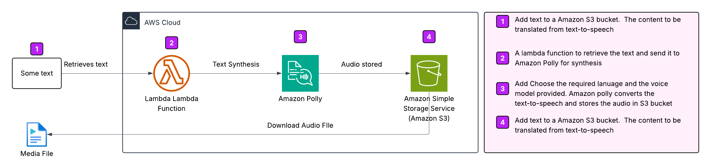

# Text Narrator with Polly

## 🌟 Overview

In this project, I developed a text-to-speech narrator using Amazon Polly. Text content is uploaded to an Amazon S3 bucket, where it is automatically converted into natural-sounding speech. The narrator supports customizable options such as voice selection, pitch, and language, allowing for flexible and dynamic audio output.

## ☁️ AWS Architecture
### 🛠️ Services used
* Amazon Polly: Converts text to life like speech with customizable features.
* AWS Management Console: Manages accounts and configures Amazon Polly.
* AWS IAM: Ensures secure access by managing user permissions.
  * Created a lambda service role and added the following permission policies 
    * AmazonPollyFullAccess 
    * AmazonS3FullAccess 
    * AWSLambdaBasicExecutionRole

### Architecture Diagram

## &rarr; Final Result

